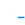

<a name="readme-top"></a>
[![Contributors][contributors-shield]][contributors-url]
[![Forks][forks-shield]][forks-url]
[![Stargazers][stars-shield]][stars-url]
[![Issues][issues-shield]][issues-url]
[![GNU License][license-shield]][license-url]
[![LinkedIn][linkedin-shield]][linkedin-url]


<!-- PROJECT LOGO -->
<br />
<div align="center">
  <a href="https://github.com/FalconEthics/mrsoumikdas.com">
    
  </a>

<h3 align="center">My Portfolio Site!</h3>

  <p align="center">
    - this is the source code my portfolio site
    <br />
    <a href="https://mrsoumikdas.com/">View Demo</a>
    ·
    <a href="https://github.com/FalconEthics/mrsoumikdas.com/issues">Report Bug</a>
    ·
    <a href="https://github.com/FalconEthics/mrsoumikdas.com/issues">Request Feature</a>
  </p>
</div>

## <a href="https://mrsoumikdas.com">Open Site</a>

<!-- ABOUT THE PROJECT -->

## About The Project

<details>
  <summary>Table of Contents</summary>
  <ol>
    <li>
      <a href="#about-the-project">About The Project</a>
      <ul>
        <li><a href="#built-with">Built With</a></li>
      </ul>
    </li>
    <li><a href="#contributing">Contributing</a></li>
    <li><a href="#license">License</a></li>
    <li><a href="#contact">Contact</a></li>
  </ol>
</details>

[![Product Name Screen Shot][product-screenshot]](https://mrsoumikdas.com)
Initially a fiend of mine helped me 

<p align="right">(<a href="#readme-top">back to top</a>)</p>

### Built With

Here are all the tools used in the build.

* [![JS][Es6.com]][Es6-url] - JavaScript Framework
* [![Bootstrap][Bootstrap.com]][Bootstrap-url] - CSS Library
* [![Git][Git.com]][Git-url] - Deployment

<p align="right">(<a href="#readme-top">back to top</a>)</p>


## Contributing

Contributions are what make the open source community such an amazing place to learn, inspire, and create. Any
contributions you make are **greatly appreciated**.

If you have a suggestion that would make this better, please fork the repo and create a pull request. You can also
simply open an issue with the tag "enhancement".
Don't forget to give the project a star! Thanks again!

1. Fork the Project
2. Create your Feature Branch

 ```sh
git checkout -b feature/AmazingFeature
```

3. Commit your Changes

```s
git commit -m Add some AmazingFeature
```

4. Push to the Branch

```s
git push origin feature/AmazingFeature
```

5. Open a Pull Request

<p align="right">(<a href="#readme-top">back to top</a>)</p>


<!-- LICENSE -->

## License

Distributed under the GNU License. See `LICENSE.txt` for more information.

<p align="right">(<a href="#readme-top">back to top</a>)</p>


<!-- CONTACT -->

## Contact

<ul>
<li><a href="https://www.linkedin.com/in/soumik-das-profile/"> LinkedIn Profile</a></li>
<li><a href="https://mrsoumik-das.com"> Portfolio Site</a></li>
<li><a href="https://twitter.com/Mr_Soumik_Das"> Twitter Handle</a></li>
</ul>

~ wanna checkout my other projects: [https://github.com/FalconEthics](https://github.com/FalconEthics)

<!-- MARKDOWN LINKS & IMAGES -->
<!-- https://www.markdownguide.org/basic-syntax/#reference-style-links -->

[contributors-shield]: https://img.shields.io/github/contributors/FalconEthics/mrsoumikdas.com.svg?style=for-the-badge

[contributors-url]: https://github.com/FalconEthics/mrsoumikdas.com/graphs/contributors

[forks-shield]: https://img.shields.io/github/forks/FalconEthics/mrsoumikdas.com.svg?style=for-the-badge

[forks-url]: https://github.com/FalconEthics/mrsoumikdas.com/network/members

[stars-shield]: https://img.shields.io/github/stars/FalconEthics/mrsoumikdas.com.svg?style=for-the-badge

[stars-url]: https://github.com/FalconEthics/mrsoumikdas.com/stargazers

[issues-shield]: https://img.shields.io/github/issues/FalconEthics/mrsoumikdas.com.svg?style=for-the-badge

[issues-url]: https://github.com/FalconEthics/mrsoumikdas.com/issues

[license-shield]: https://img.shields.io/github/license/FalconEthics/mrsoumikdas.com.svg?style=for-the-badge

[license-url]: https://github.com/FalconEthics/mrsoumikdas.com/blob/main/LICENSE

[linkedin-shield]: https://img.shields.io/badge/-LinkedIn-black.svg?style=for-the-badge&logo=linkedin&colorB=555

[linkedin-url]: https://www.linkedin.com/in/soumik-das-profile/

[product-screenshot]: https://raw.githubusercontent.com/FalconEthics/mrsoumikdas.com/main/screenshot.png

[Bootstrap.com]: https://img.shields.io/badge/tailwind-563D7C?style=for-the-badge&logo=tailwindcss&logoColor=white

[Bootstrap-url]: https://tailwindcss.com/

[Es6.com]: https://img.shields.io/badge/P5.js-7BDCB5?style=for-the-badge&logo=p5.js&logoColor=white

[Es6-url]: https://p5js.org/

[Git.com]: https://img.shields.io/badge/vercel-FF6900?style=for-the-badge&logo=vercel&logoColor=white

[Git-url]: https://vercel.com/